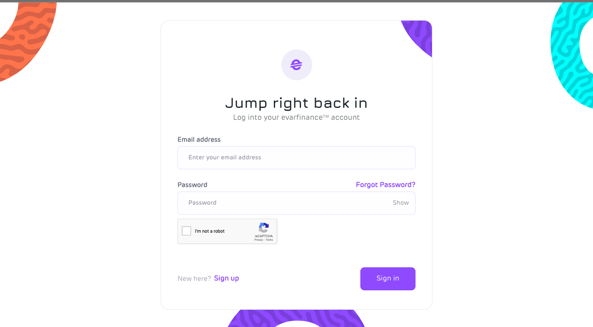
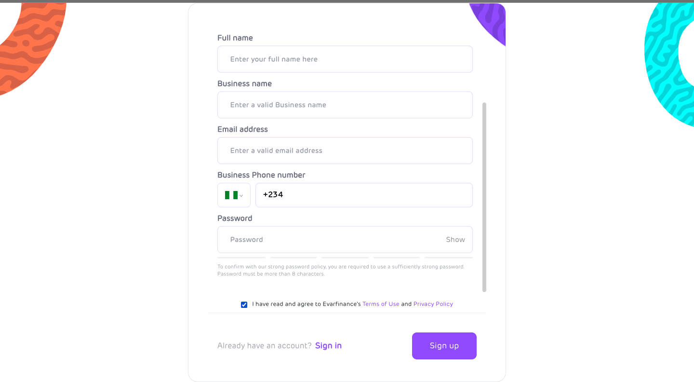
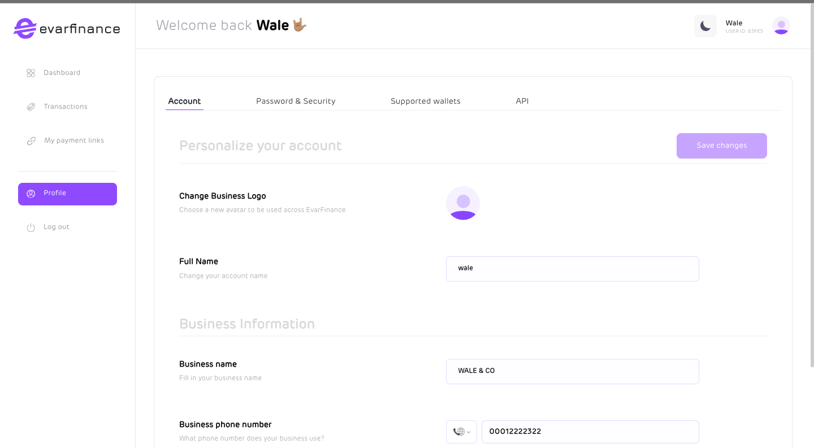
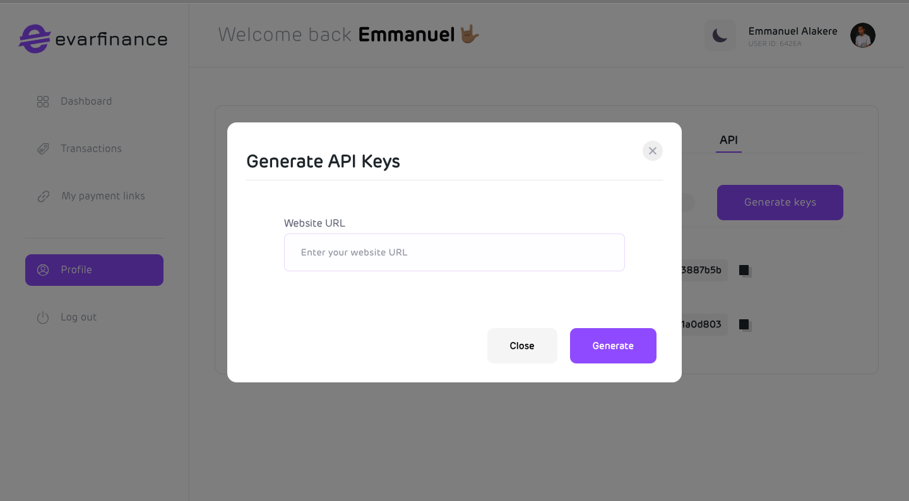

# Generate API keys

Welcome to the API Keys Documentation, your comprehensive guide to generating and managing API keys for seamless integration with our services. In this documentation, we'll walk you through the step-by-step process of creating API keys, providing you with the necessary information to leverage the full potential of our APIs. Let's dive in!

:::tip API keys

Always make sure you have your API keys before proceeding with the integration. the next step will show you how to get your API keys

:::

## Generating API keys

To initiate the process, follow the steps below to create an account on Evarfinance

### 1. Create account

- Type in [app.evarfinance.com](https://app.evarfinance.com/signin) in your browser and navigate to the **signup** page to begin the sign-up process.

  

  

  

- fill in your correct details in the form below

  

  

  

### 2. Sign in your account

- Sign in your account using your correct email address and password.

  

  

  

### 3. Generate the keys

- On the dashboard click on the **menu icon** and select the **profile** option

  

  

  

- On the profile page, under the Api section click on the **Generate keys** button and insert your website url. Example: http://localhost.com

  

  

  

- Click on the Generate button and there you go, your API keys have been generated successfully.
