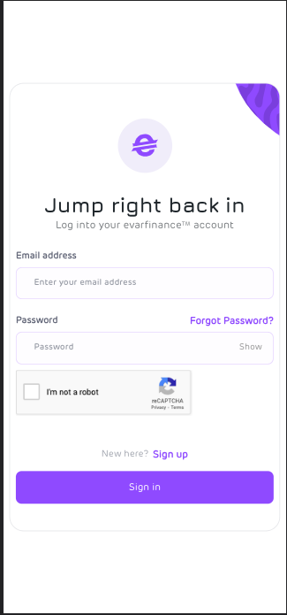
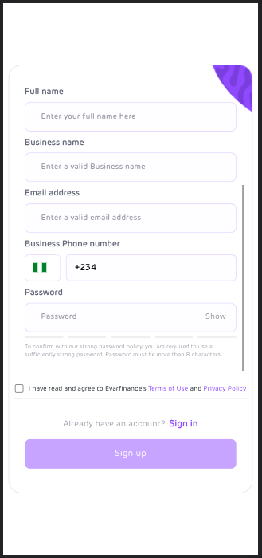
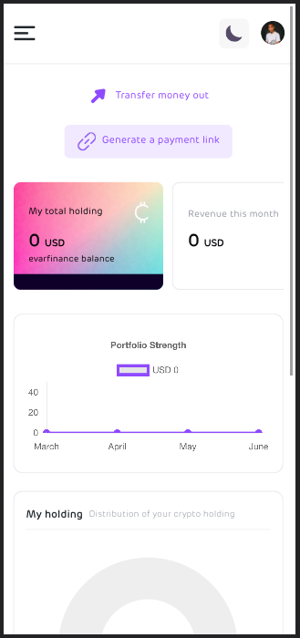
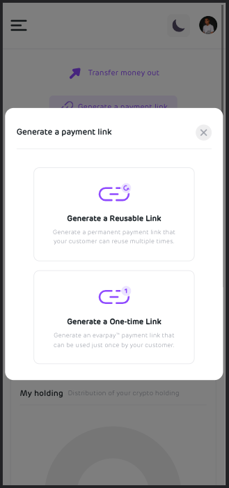
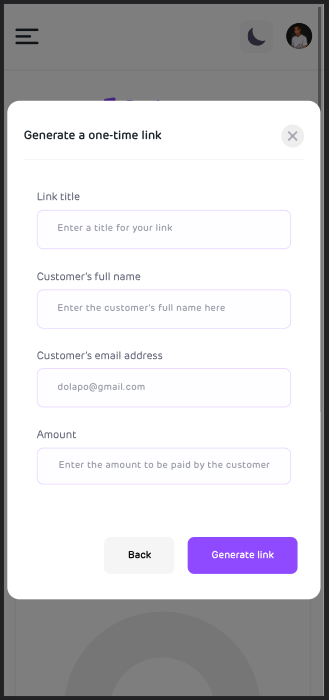
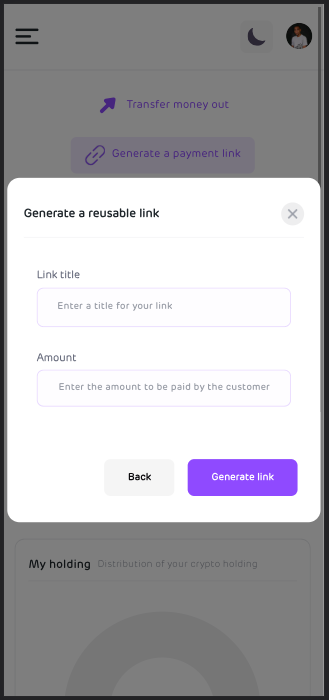
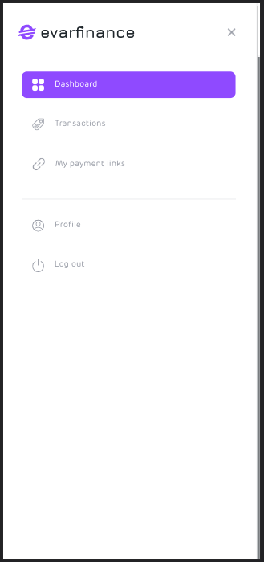

# Receiving payments

Receiving payment for your products and services as a merchant or creator on Evarfinance can be a simple process if you know the steps to follow. Here’s a quick guide on how to sign up and enable payment.

## Step 1 : Create an Evarfinance account

To get started, you would need to create an account on evarfinance and to do that, you would need to follow these steps below

- Input [app.evarfinance.com](https://app.evarfinance.com/signin) into your browser and proceed to the next page to sign up.

  

- Instead of clicking on sign in, click on sign up and proceed to the next page. On the next page, you're expected to input accurate details of yourself from your full name to your business name and your valid email address.
  Also do well to input your correct phone number and a "Strong" Password. By strong, we mean that your password must contain some numbers, uppercase and lowercase letters with a special character. They must also be more than 8 characters in total.

  

- After you have done all these, you would proceed to accept our Terms of use and privacy policy then click on Sign Up. You would then wait for a verification mail and proceed to verify your account.

## Step 2 : Sign back in

Now, that you have created your account on evarfinance, you can now go ahead to carry out transactions on the app. But first, you would need to create your payment link.

- Visit [app.evarfinance.com](https://app.evarfinance.com/signin) input your user details and click on sign in.

  

- Proceed to the next page which is the user board and click on generate payment link which is at the top right side of your screen if you're using a desktop.

  

- When you click on generate payment, a pop up comes up which shows you our options of payment links. There are two options of payment links which are The One time payment link which allows you receive a one time payment from one customer/client and the Reusable payment link which allows you receive payments multiple times using the same link.

  

- Click on any of the payment links that suit your transaction method and proceed.

- For the one time payment link, you'll be required to input the particular customer's full name and email address.

  

- For the reusable payment link, you would not be required to fill in a specific customer's detail because this link allows you to receive payment from multiple customers or clients.

  

  After all these fields have been imputed, click on the next button and proceed to generate the payment link for both one time and the reusable. Then copy the link and proceed to send to your client or customer.

- To view all your previously payment links, click on the "User Dashboard button" by your top left.

  

  Now click on **my payment links** to view all your previously generated payment links.

- To receive payment send the links to your customer.
