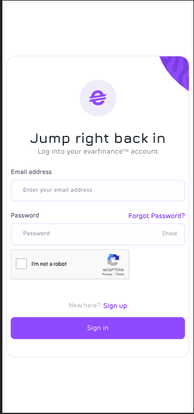
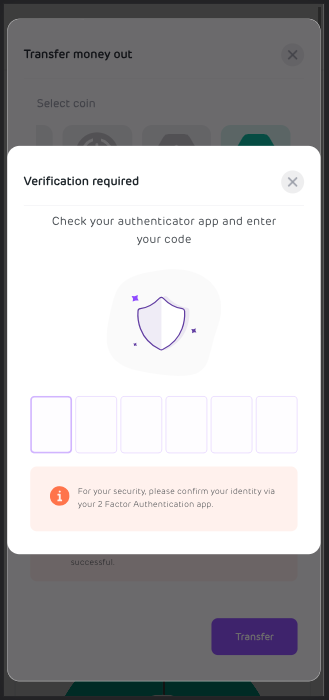

# Transfer Funds Out

In transferring funds out as a merchant or creator on Evarfinance into your wallet, understanding the necessary steps can make the process straightforward. To help you get started, here's a brief guide on signing in and activating your fund transfer.

:::tip Don't have AN account?

If you don't have an account with us, please create an account, you can follow the guide in the **Receiving payments** section.

:::

### Sign back in

To transfer your funds to your desired wallet, please sign into your account with your correct email and password. Visit [app.evarfinance.com](https://app.evarfinance.com/signin)

### Transfer funds

- On your dashboard click on the **transfer money out** button

  

- Select your desired **coin**, input your destination **wallet address**, and enter your **amount**. You also click on the **max** icon to select all your funds. click on the transfer button to proceed.

  

- Setup your authentication by downloading the Google Authenticator app or any other Authenticator app of your choice from the Google Play Store or Apple App Store.

  

  

- For returning user, open your authentication app and enter the pin to make transfer.

  
